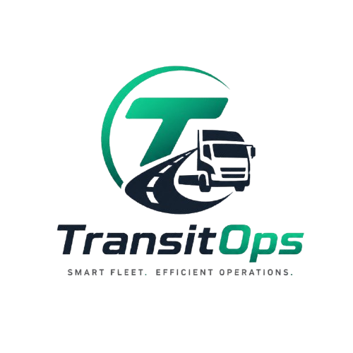

<div align="center">
  
  
  # 🚚 TransitOps
  
  **Intelligent Fleet Operations Platform**

  [](https://nextjs.org/)
  [](https://tailwindcss.com/)
  [](https://supabase.com/)
  [](https://www.typescriptlang.org/)
</div>

<br />

**TransitOps** is a modern, responsive, and robust fleet management application. Built to eliminate the chaos of paper logs and spreadsheets, it acts as a digital control center for your logistics pipeline. 

With advanced PostgreSQL native triggers enforcing business rules automatically, TransitOps guarantees that mistakes like double-booking a driver, overloading a vehicle, or dispatching a truck in the shop *never* happen.

---

## ✨ Key Features

- **🚗 Advanced Vehicle Registry:** Track your entire fleet, including cargo capacities, odometer readings, and real-time operational status.
- **🧑‍✈️ Driver & License Management:** Monitor driver safety scores and track license expiration dates proactively.
- **🛣️ Intelligent Dispatch Engine:** Create trips with source, destination, and cargo weights. Our database native constraints automatically block invalid dispatches (e.g. assigning a driver already on a trip).
- **💸 Fuel & Expense Tracking:** Log maintenance costs, fuel consumption, and tolls to calculate exact ROI on a per-vehicle basis.
- **🔐 Role-Based Access Control:** Secure access tailored for Fleet Managers, Drivers, Safety Officers, and Financial Analysts.

---

## 🛠️ Technology Stack

| Category | Technology |
|---|---|
| **Frontend Framework** | Next.js 16 (App Router) |
| **Styling & UI** | TailwindCSS v4, shadcn/ui |
| **Backend & Auth** | Supabase (PostgreSQL + GoTrue Auth) |
| **Business Logic** | Database Triggers & RPCs (Trigger-First Architecture) |
| **Validation** | Zod (v4) |

---

## 🚀 Quick Start Guide

Want to run TransitOps locally? Follow these steps to get your environment up and running in minutes.

### 1. Clone the Repository
```bash
git clone https://github.com/SHIVKUMAR908173/transit-ops.git
cd transit-ops
```

### 2. Install Dependencies
```bash
npm install
```

### 3. Setup Supabase Environment Variables
Create a `.env.local` file in the root directory and add your Supabase credentials:
```env
NEXT_PUBLIC_SUPABASE_URL=your-supabase-project-url
NEXT_PUBLIC_SUPABASE_ANON_KEY=your-supabase-anon-key
```

### 4. Run the Database Migrations
Initialize the robust database schema by running the migration script in your Supabase SQL Editor:
1. Open `supabase/migrations/20260712000000_backend_rebuild.sql`
2. Copy the contents and execute them in your Supabase project.

*(Optional)* Run `supabase/seed.sql` to populate your database with dummy test data!

### 5. Launch the App
```bash
npm run dev
```
Navigate to [http://localhost:3000](http://localhost:3000) to see TransitOps in action!

---

<div align="center">
  Built with ❤️ for modern logistics teams.
</div>
